<p align="center">
  
</p>

<p align="center">
  <a href="https://github.com/td185721/vtable-dump/actions/workflows/ci.yml"></a>
  <a href="https://github.com/td185721/vtable-dump/releases/latest"></a>
  
  
  <a href="LICENSE"></a>
</p>

<p align="center">
  <sub><b>Toolkit:</b> <a href="https://github.com/td185721/pe-walker">pe-walker</a> · <a href="https://github.com/td185721/pe-diff">pe-diff</a> · <a href="https://github.com/td185721/rtti-dump">rtti-dump</a> · <b>vtable-dump</b> · <a href="https://github.com/td185721/pattern-scan">pattern-scan</a> · <a href="https://github.com/td185721/unwind-map">unwind-map</a></sub>
</p>

`vtable-dump` finds the virtual function tables of C++ classes in x64 Windows binaries built with MSVC and lists the function in every slot. In a stripped binary, vtables are the fastest way from "there is a class here" to "here is its code": every virtual method of every polymorphic class, grouped by class, with no disassembly involved.

## Example

Real output for the test fixture, built from [`tests/fixtures/sample.cpp`](tests/fixtures/sample.cpp). `io::Buffer` inherits from both `io::Reader` and `io::Writer`, so it has two vtables, one per base subobject:

```console
$ vtable-dump --filter Buffer sample64.dll
[*] scanning for Complete Object Locators ...
    found 14 COL(s)
[*] scanning for vtables that reference them ...
    found 14 vtable(s); filtering by 'Buffer'

.?AUBuffer@io@@
  vtable RVA : 0x00003208
  slot count : 2
    [ 0] fn @ RVA 0x00001010
    [ 1] fn @ RVA 0x000011c0

.?AUBuffer@io@@
  vtable RVA : 0x00003220
  slot count : 3
    [ 0] fn @ RVA 0x00001000
    [ 1] fn @ RVA 0x000011f0
    [ 2] fn @ RVA 0x00001160

[*] 2 of 14 vtable(s) matched the filter
```

The first table is the `Reader` view: the destructor and `read()`. The second is the `Writer` view: the destructor, `write()` and `flush()`. Jump to any of those RVAs in Ghidra, IDA or x64dbg to see the implementation.

## How it works

MSVC places a pointer to the class's Complete Object Locator in the slot just before each vtable:

```text
            ┌──────────────────────────────┐
vtable - 8  │ &CompleteObjectLocator       │ ──► RTTI: class name, hierarchy
vtable + 0  │ &virtual function 0          │ ──► .text
vtable + 8  │ &virtual function 1          │ ──► .text
   ...      │ ...                          │
            └──────────────────────────────┘
```

1. Find every Complete Object Locator in `.rdata`: signature `1`, and a `pSelf` field equal to its own RVA (the same validation as [rtti-dump](https://github.com/td185721/rtti-dump)).
2. Compute each COL's absolute address (`ImageBase + RVA`) and scan `.rdata` for 8-byte values equal to it. Each hit is the slot just before a vtable.
3. Walk forward while the entries point into an executable section; those are the virtual functions. Stop at the first null or non-code pointer.

## Install

Download a prebuilt binary for Windows x64, Linux x64 (statically linked) or macOS arm64 from the [latest release](https://github.com/td185721/vtable-dump/releases/latest), or build from source with CMake 3.15+ and any C++17 compiler:

```sh
cmake -S . -B build -DCMAKE_BUILD_TYPE=Release
cmake --build build --config Release
ctest --test-dir build -C Release      # optional: run the test suite
```

## Usage

```text
vtable-dump [--max-slots N] [--filter|-f SUBSTRING] <file.exe|file.dll>
```

| Flag | Effect |
|---|---|
| `--max-slots N` | Print at most N slots per vtable (default 32). The full slot count is still shown. |
| `--filter SUB`, `-f SUB` | Only show vtables whose mangled class name contains `SUB`. |

Exit status is `0` on success, `1` for an unreadable, malformed or non-x64 file, and `2` for a usage error.

## Typical workflow

1. `rtti-dump --demangle target.exe` shows the classes and their inheritance.
2. `vtable-dump --filter Widget target.exe` shows where those classes' vtables live and what is in each slot.
3. In your disassembler, jump to a slot's RVA and name the function after its class.

## Scope and limits

- **x64 only.** 32-bit MSVC uses absolute pointers in RTTI and is rejected with a clear error.
- **MSVC only.** The Itanium ABI used by MinGW and Clang has no Complete Object Locator before the vtable.
- **Needs RTTI.** Classes compiled with `/GR-` have no COL, so their vtables are not found.
- **Slot order is MSVC's.** A base class's virtual functions keep their slot numbers in derived vtables; new virtual functions are appended.

## Testing

`ctest` compares the output for the fixture DLL with golden files: all vtables, `--filter` and `--max-slots`. It also checks that x86 input and missing arguments fail with the right exit codes. CI runs on Windows (MSVC), Linux (GCC) and macOS (Clang), and cross-builds with MinGW-w64. When the tool moved from `<windows.h>` to a portable PE header, its output was compared with the previous build on 250 `System32` DLLs, and there were no differences. Header, section table and name reads are bounds-checked against the file.

## License

MIT, see [LICENSE](LICENSE).
